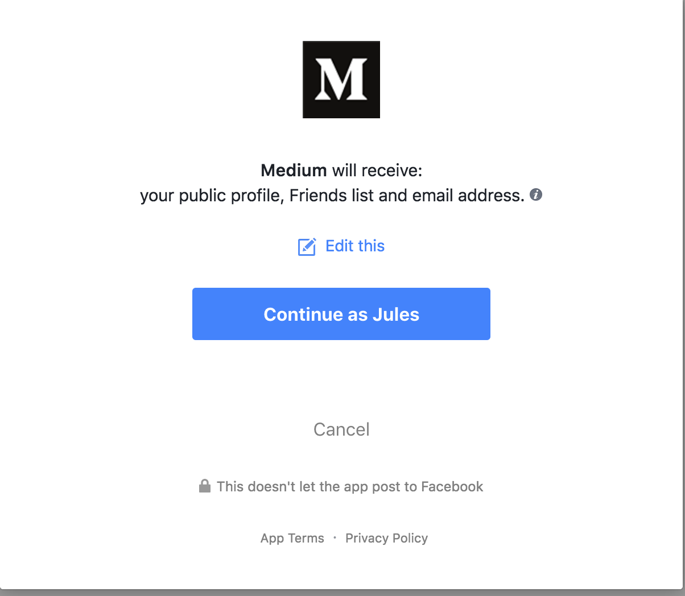

# Facebook Data Leak: How I "started worrying and stopped living"

> [*Originally posted on Openlearning (Sunday, 15 Apr 2018)*](https://www.openlearning.com/u/julesrigaudie/blog/FacebookDataLeakHowIQuotStartedWorryingAndStoppedLivingQuot/)

The Facebook Data Leak has brought light to data harvesting practice from large tech companies. There are a few different issues which stand out.

## Sharing too much data

Firstly, Facebook has given huge access to developers by allowing them to gain large amounts of data from users logging in to their application.

When you logging into a 3rd party application/website, you may sometimes get a "Login using Facebook" button. Using it will allow you to create an account with Facebook. It is mostly for convenience as it is much faster to use than to create an account manually. The problem is most people don't read the consent page and simply click the continue button.

If you click on the "edit this" hyperlink, you can view and edit some of the information passed to Facebook. As you can see from the picture below, you can't disallow the 3rd party to access to all of the information.

Now, why would the average website need to know my age, what I look like, what my gender is and more?...

Some information might be useful for an app to work properly such as the email address but a lot of the information a developer can request is completely useless for the app itself...

Facebook has reacted to the concern by restricting the amount of data accessible from its API and removing endpoints. This is a step in the right direction but has can be seen from the images above, it's not enough. Users should have more power over the things they want to share with 3rd parties.

## What should you do as a user?

If you are using Facebook to login to app/websites, you should create a specific account just for that. I would also suggest creating an email specifically for this so you share minimal information to 3rd parties.

### Harvesting too much data

Facebook is known to keep track of large amounts of data for advertising purposes. (and probably shares most of it with the NSA...) It's large 3rd party usage also allows it to track your interests around the internet as well.

<!-- As I discovered, it even adds meta-data to images you download. -->

Facebook itself is a pretty awesome product to keep connected with your friends and easily communicate with them. Everyone nowadays has Facebook and many people swear on it to communicate.

The easiest way to stop giving information away would be to stop using Facebook... But even then your friends might share information about you without you knowing. (Pictures of you at a party, message someone about you, etc)

## So how could we minimize the amount of information we share on Facebook while still keeping the functionalities it offers?

The other idea would be to make the data useless to Facebook. We could **encrypt** as much of the data as we can so that users could keep on communicating but Facebook wouldn't be able to use any of the data. This would require posts, images, and messages to be encrypted between users. This would be a drastic solution but would remove multiple of the Facebook features. I do believe it is the way to go if you wish to continue using the service.

Regarding tracking over the internet, I suggest using tracking prevention apps such as [privacy badger](https://chrome.google.com/webstore/detail/privacy-badger/pkehgijcmpdhfbdbbnkijodmdjhbjlgp) and [uBlock Origin](https://chrome.google.com/webstore/detail/ublock-origin/cjpalhdlnbpafiamejdnhcphjbkeiagm?hl=en). They will make it more difficulty (but not impossible) to track you from your browser settings. They are available in both Firefox and Chrome.