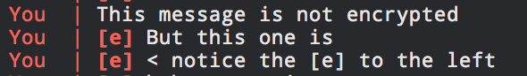

# Silentbook - An Encrypted Facebook messenger

This is a Proof-of-Concept allowing encrypted messaging over Facebook. The messages are encrypted using AES256 before being sent meaning it's impossible for Facebook to view the contents of the messages.

## Silentbook in action

> Encrypted messages are denoted by a `[e]` at the start of the message.

## Why make a encrypted facebook messenger?

Since the Cambridge Analytica and Facebook scandal, many have started to despise Facebook and it's service. The problem is that people will continue to use the service and will soon forget everything that happened.

By using encryption to you can reduce a lot of the data you give to Facebook while still allowing all the features to be used.

I talked about the idea with a friend and we decided it would be interesting to create a proof of concept app to send encrypted messages over Facebook messenger.

Our objective was to protect our messages from being seen by Facebook itself.
We talked about different ideas and finally came up with a simple protocol.

Here is our communication protocol:

1. We generate a symmetric key and exchange it in person using a USB key or we send the key over a trustworthy 3rd party (Keep in mind we're trying to protect Facebook from seeing our messages in this case)
2. We encrypt all our messages using the symmetric key and AES 256 encryption
3. We then base64 encode it and send it over Facebook
4. To read the messages, we do the process in the opposite direction from 3-2

This process is definitely not flawless as if the key is leaked by the 3rd party then Facebook can decrypt all messages or if Facebook leaks our messages, the 3rd party is able to read it. (No backward secrecy)

There is still a decent amount of data being leaked to Facebook such as the length of the messages and the message frequency.

Additionally, a replay attack is also possible by resending an earlier message.

A more robust solution would be to use the Signal Protocol to exchange keys easily and improve our protocol.

The process of encrypting a message is quite impractical if done manually therefore, we created a p.o.c. app to do it for us.

## How to use

**WARNING: IF YOUR ACCOUNT IS NEW, THIS WILL PROBABLY TRIGGER SPAM DETECTION AND GET YOUR ACCOUNT BLOCKED UNTIL YOU VERIFY PHONE AND POTENTIALLY MORE. USE AT YOUR OWN RISK.**

1. Exchange a secure passphrase with the person you want to communicate securely with. This will be converted into an assymetric encryption key.
2. Clone the repo
3. Run `npm install` to install the dependencies
4. Run `mv creds_example.js creds.js` to create the required `creds.js` file
5. Edit the `creds.js` file and add your Facebook credentials and the secret passphrase agreed upon with your friend or whoever you're communicating with
6. Run `node index.js` to start the app and follow the instructions to start communicating securely

## Limitations

- Encrypting messages does not mean you are not providing information to Facebook. You are still giving a lot of metadata such as ip address, location, who you are talking with, the frequency of messages, the lenght of messages, etc.. More precautions are required if you want to be completely anonymous.
- Currently it is not possible to create a new thread from the program directly and you therefore need to initiate the conversation from Facebook messenger
